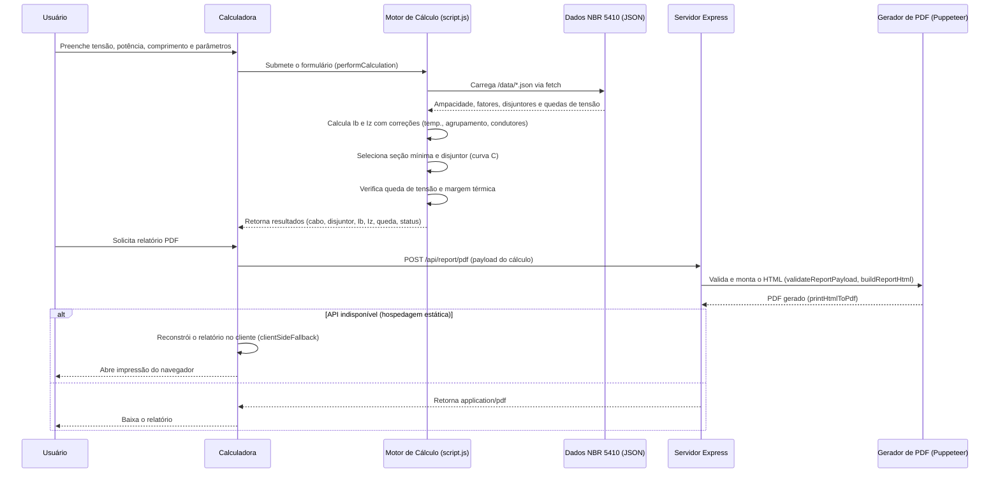
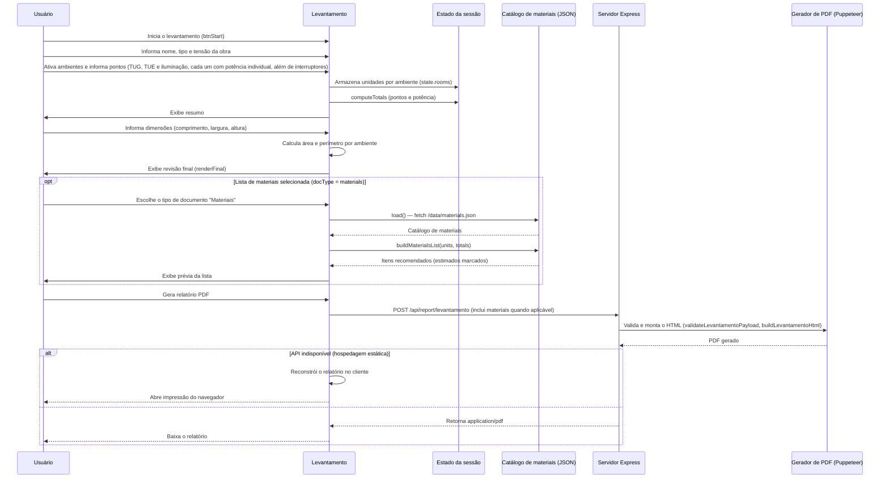
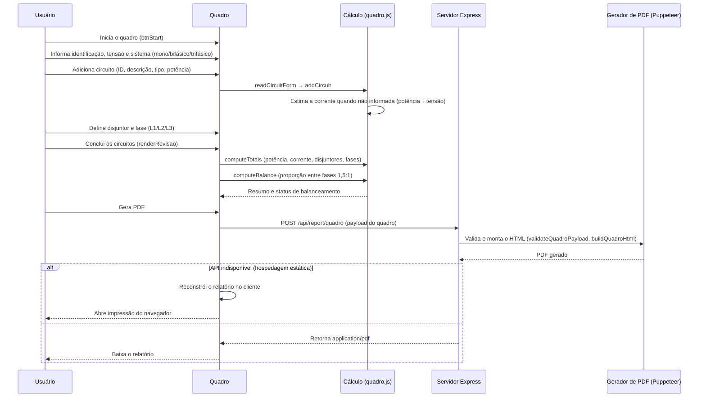

<p align="center">
  
</p>

# DimenVolt Studio

> Plataforma web para levantamento de instalações, dimensionamento de condutores e quadros de distribuição conforme a NBR 5410, com geração de relatórios técnicos em PDF.

---

## ✦ ABOUT

O DimenVolt Studio é uma plataforma de engenharia elétrica que cobre o fluxo completo de um projeto: levantamento dos ambientes e pontos elétricos, dimensionamento de cabos e disjuntores, montagem do quadro de distribuição e emissão de documentos técnicos.

O frontend é 100% estático e funciona em qualquer hospedagem estática (incluindo Vercel). Todo o cálculo roda no navegador. Um backend opcional em Node.js/Express adiciona geração server-side de PDF via Puppeteer; quando a API não está disponível, a plataforma reconstrói o relatório no cliente e abre a impressão do navegador (salvar como PDF).

---

## ✦ FEATURES

- **Levantamento elétrico** por ambientes com contagem separada de tomadas de uso geral (TUG) e uso específico (TUE) e pontos de iluminação, cada um com potência individual, além de interruptores e dimensões (área, perímetro e pé-direito).
- **Dimensionamento conforme NBR 5410** no navegador: corrente de projeto (Ib), capacidade de condução (Iz), seleção de seção, queda de tensão e margem térmica.
- **Seleção automática de disjuntor** (curva C) com coordenação Ib <= In <= Iz.
- **Fatores de correção** por temperatura ambiente, agrupamento de circuitos e condutores carregados.
- **Condutor neutro e PE** dimensionados a partir da seção de fase.
- **Quadro de distribuição**: circuitos, disjuntores, fases (L1/L2/L3) e balanceamento automático entre fases.
- **Lista de materiais estimada** a partir dos dados do levantamento (itens estimados sinalizados).
- **Relatórios PDF técnicos** com numeração própria (RT-DIM, RT-LVT, RT-QDR) e modo duplo de geração.
- **Tabelas de referência NBR 5410** integradas (capacidade de corrente e disjuntores).

---

## ✦ SYSTEM FLOW

Todos os cálculos são executados no navegador (JavaScript puro), lendo bases de dados JSON por `fetch`. O servidor Express é usado somente para gerar PDF via Puppeteer; em hospedagem estática, a geração cai no fallback do navegador.

### Electrical Dimensioning



### Electrical Survey



### Distribution Board



---

## ✦ PROJECT STRUCTURE

```
├── data/                             # Bases de dados NBR 5410 (JSON)
│   ├── ampacity.json                 # Capacidade de condução de corrente
│   ├── circuit_breakers.json         # Disjuntores normalizados
│   ├── grouping_factors.json         # Fatores de agrupamento e condutores carregados
│   ├── load_database.json            # Base de cargas
│   ├── materials.json                # Catálogo de materiais do levantamento
│   ├── minimum_sections.json         # Seções mínimas por tipo de circuito
│   ├── nbr5410_settings.json         # Configurações (seções padrão, fator de potência)
│   ├── neutral_conductor.json        # Dimensionamento do neutro
│   ├── protective_conductor_PE.json  # Dimensionamento do PE
│   ├── temperature_correction.json   # Fatores de correção de temperatura
│   └── voltage_drop.json             # Resistência e reatância para queda de tensão
├── src/
│   ├── backend/
│   │   └── server.js                 # API Express (rotas e geração de PDF)
│   ├── frontend/
│   │   ├── pages/                    # index (landing), calculadora, levantamento, quadro
│   │   ├── scripts/
│   │   │   ├── script.js             # Motor de dimensionamento (calculadora)
│   │   │   ├── levantamento.js       # Fluxo do levantamento
│   │   │   ├── quadro.js             # Fluxo do quadro de distribuição
│   │   │   ├── materials-service.js  # Serviço de materiais (estimativa)
│   │   │   └── landing.js            # Interações da landing page
│   │   └── styles/
│   │       ├── tokens.css            # Design system (cores, tipografia, motion)
│   │       ├── landing.css           # Estilos da landing
│   │       ├── style.css             # Estilos da calculadora
│   │       ├── levantamento.css      # Estilos do levantamento
│   │       └── quadro.css            # Estilos do quadro
│   └── reports/
│       ├── pdfGenerator.js           # Validação de payloads e montagem dos PDFs
│       └── pdf-report.js             # Cliente: POST para a API + fallback de impressão
├── vercel.json                       # Rewrites para rotas limpas
└── package.json
```

---

## ✦ DATA

As bases técnicas são arquivos JSON em `data/`, consumidos diretamente pelo navegador e, quando necessário, também pelo gerador de PDF.

| Arquivo | Conteúdo |
| ------- | -------- |
| `ampacity.json` | Capacidades de condução de corrente por material, isolamento, método de instalação e seção |
| `circuit_breakers.json` | Valores normalizados de disjuntores |
| `grouping_factors.json` | Fatores de agrupamento e de condutores carregados |
| `load_database.json` | Base de cargas de referência |
| `materials.json` | Catálogo de materiais usado na lista do levantamento |
| `minimum_sections.json` | Seções mínimas por tipo de circuito (iluminação, TUG, TUE) |
| `nbr5410_settings.json` | Seções padrão e fator de potência padrão |
| `neutral_conductor.json` | Dimensionamento do condutor neutro |
| `protective_conductor_PE.json` | Dimensionamento do condutor de proteção (PE) |
| `temperature_correction.json` | Fatores de correção por temperatura |
| `voltage_drop.json` | Resistência (R) e reatância (X) por seção |

---

## ✦ SETUP

Pré-requisitos: Node.js 18 ou superior.

```bash
npm install
npm start        # ou npm run dev
```

O servidor sobe em `http://localhost:3000`. O `npm install` baixa o Chromium usado pelo Puppeteer na geração server-side dos PDFs.

| Rota           | Página                              |
| -------------- | ----------------------------------- |
| `/`            | Landing page                        |
| `/calculadora` | Calculadora de dimensionamento      |
| `/levantamento`| Levantamento elétrico da instalação |
| `/quadro`      | Quadro de distribuição              |

---

## ✦ DEPLOYMENT

A aplicação é compatível com Vercel em modo estático: o `vercel.json` mapeia as rotas limpas para os arquivos em `src/frontend/pages/`, e os dados em `data/` são servidos como arquivos estáticos.

Nesse cenário as rotas de API de PDF (`/api/report/pdf`, `/api/report/levantamento`, `/api/report/quadro`) não estão disponíveis, mas o fallback client-side reconstrói o relatório no navegador e abre a impressão (salvar como PDF), preservando os mesmos templates e validações.

Para geração server-side de PDF, hospede o servidor Express em um ambiente Node com Chromium (VPS ou container Docker).

---

## ✦ ROADMAP

- Salvar e reabrir projetos (localStorage ou conta na nuvem).
- Cálculo de demanda e dimensionamento de alimentadores conforme fatores de demanda da NBR 5410.
- Exportação de plantas e esquemas em formatos CAD.
- Testes automatizados para o motor de dimensionamento.
- Suporte a iluminação conforme NBR ISO/CIE e correção de fator de potência.

---

## ✦ LICENSE

Este projeto é de uso proprietário/privado. Não há arquivo de licença incluído e todos os direitos são reservados; nenhuma licença de uso, cópia ou distribuição é concedida.
