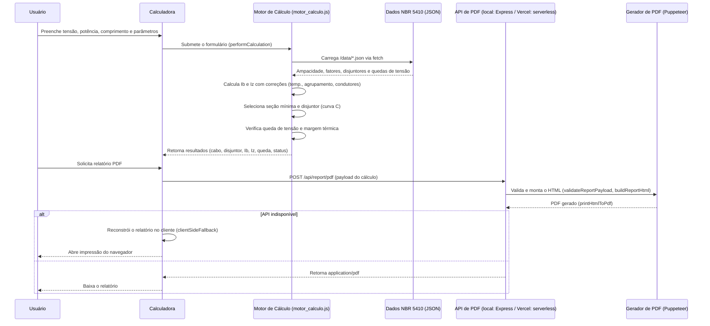
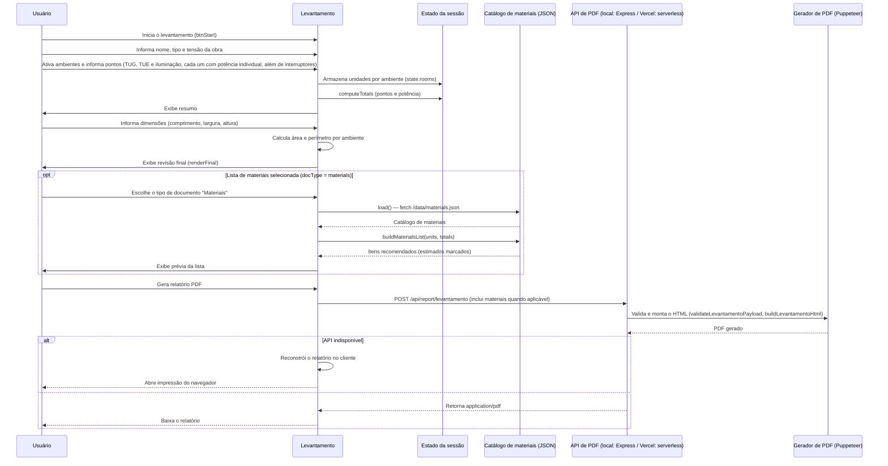
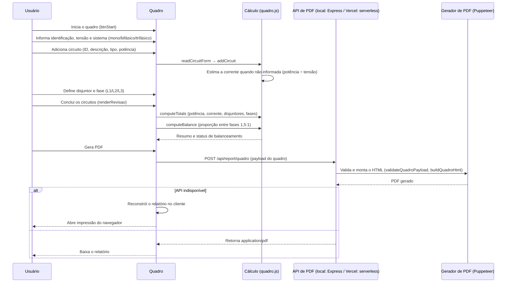

<p align="center">
  
</p>

# DimenVolt Studio

> Plataforma web para levantamento de instalações, dimensionamento de condutores e quadros de distribuição conforme a NBR 5410, com geração de relatórios técnicos em PDF.

---

## ✦ ABOUT

O DimenVolt Studio é uma plataforma de engenharia elétrica que cobre o fluxo completo de um projeto: levantamento dos ambientes e pontos elétricos, dimensionamento de cabos e disjuntores, montagem do quadro de distribuição e emissão de documentos técnicos.

O frontend é 100% estático e todo o cálculo roda no navegador. Em produção, a geração server-side de PDF é feita pelas serverless functions da Vercel em `api/report/*`; o `local_dev/server.js` (Express) existe **apenas** como servidor de desenvolvimento local e não é executado em produção. Quando nenhuma API está disponível, a plataforma reconstrói o relatório no cliente e abre a impressão do navegador (salvar como PDF).

---

## ✦ FEATURES

- **Levantamento elétrico** por ambientes com contagem separada de tomadas de uso geral (TUG) e uso específico (TUE) e pontos de iluminação, cada um com potência individual, além de interruptores e dimensões (área, perímetro e pé-direito).
- **Dimensionamento conforme NBR 5410** no navegador: corrente de projeto (Ib), capacidade de condução (Iz), seleção de seção, queda de tensão e margem térmica.
- **Seleção automática de disjuntor** (curva C) com coordenação Ib <= In <= Iz.
- **Fatores de correção** por temperatura ambiente, agrupamento de circuitos e condutores carregados.
- **Condutor neutro e PE** dimensionados a partir da seção de fase.
- **Quadro de distribuição**: circuitos, disjuntores, fases (L1/L2/L3) e balanceamento automático entre fases.
- **Lista de materiais estimada** a partir dos dados do levantamento (itens estimados sinalizados).
- **Relatórios PDF técnicos** com numeração própria (RT-DIM, RT-LVT, RT-QDR) e modo duplo de geração (serverless na Vercel ou fallback no navegador).
- **Tabelas de referência NBR 5410** integradas (capacidade de corrente e disjuntores).

---

## ✦ MODULES

- **Landing** (`/`) — apresentação da plataforma e acesso às ferramentas.
- **Calculadora NBR 5410** (`/calculadora`) — dimensionamento de condutores e disjuntores (Ib, Iz, seção, queda de tensão e margem térmica), com relatório RT-DIM.
- **Levantamento Elétrico** (`/levantamento`) — cadastro de ambientes, pontos TUG/TUE/iluminação, interruptores e dimensões, com relatório RT-LVT e lista de materiais opcional.
- **Quadro de Distribuição** (`/quadro`) — circuitos, disjuntores, fases (L1/L2/L3) e balanceamento, com relatório RT-QDR.

Cada módulo é uma página independente em `src/frontend/pages/`, alimentada pelos scripts em `src/frontend/scripts/`.

---

## ✦ PRODUCTION × LOCAL DEVELOPMENT

O projeto separa de forma estrita o que é **produção** (publicado na Vercel) do que é **infraestrutura de desenvolvimento local** (não vai para produção).

| Produção | Local development |
| -------- | ----------------- |
| `api/` | `local_dev/` |
| `src/` | — |
| `data/` | — |
| `public/` | — |

- `api/` — serverless functions da Vercel (`/api/report/pdf`, `/api/report/levantamento`, `/api/report/quadro`). Obrigatórias em produção.
- `src/` — código-fonte da aplicação (frontend em `src/frontend/` e serviços compartilhados de PDF em `src/reports/`).
- `data/` — bases de dados/JSON de configuração consumidos pela aplicação.
- `public/` — assets estáticos servidos na raiz (favicons e documento técnico em `public/documents/`).
- `local_dev/` — **apenas desenvolvimento e testes**: `local_dev/server.js` (servidor Express local), `local_dev/tests/` (suíte automatizada) e `local_dev/test-results/` (artefatos gerados, ignorados pelo git).

A produção não importa nada de `local_dev/`. A dependência existe apenas no sentido `local_dev → produção`: o servidor local e os testes usam os serviços compartilhados de `src/reports/`, mas as serverless functions de `api/` não dependem do servidor local.

---

## ✦ SYSTEM FLOW

Todos os cálculos são executados no navegador (JavaScript puro), lendo bases de dados JSON por `fetch`. A geração de PDF usa um único serviço compartilhado (`pdfGenerator.js`), montado por handlers HTTP idênticos (`report-endpoint.js`) tanto no servidor local quanto nas serverless functions da Vercel — não há lógica de PDF duplicada.

```text
Local development                        Production (Vercel)
─────────────────────                    ─────────────────────
browser ──> local_dev/server.js ──>      browser ──> Vercel CDN
              Express                                │
              │  · páginas estáticas                 │  · frontend estático (pages/)
              │  · POST /api/report/*                │  · api/report/* (serverless)
              │                                     │
              └──────────► pdfGenerator.js ◄─────────┘
          serviço único e compartilhado (validação, HTML, Puppeteer)
```

O `local_dev/server.js` roda somente em desenvolvimento: serve as páginas e expõe as mesmas rotas de API usadas pelas functions da Vercel em produção. Nenhum servidor manual é necessário para executar a aplicação na Vercel.

### Electrical Dimensioning



### Electrical Survey



### Distribution Board



---

## ✦ API DE PDF

Em produção, os relatórios são gerados pelas serverless functions da Vercel em `api/report/*`. Todas aceitam `POST` com um payload JSON (a mesma estrutura que o cliente envia) e respondem `application/pdf` com o arquivo em anexo; payloads inválidos respondem `400` com `{ "error": "..." }`.

| Endpoint | Função | Serviço compartilhado |
| -------- | ------ | --------------------- |
| `POST /api/report/pdf` | Relatório de dimensionamento da calculadora (RT-DIM) | `generateReportPdf` |
| `POST /api/report/levantamento` | Relatório do levantamento elétrico (RT-LVT), com lista de materiais quando aplicável | `generateLevantamentoPdf` |
| `POST /api/report/quadro` | Relatório do quadro de distribuição (RT-QDR) | `generateQuadroPdf` |

Em desenvolvimento, o `local_dev/server.js` expõe exatamente as mesmas três rotas — o contrato é idêntico localmente e em produção.

### Arquitetura de PDF (serviço compartilhado)

- `pdfGenerator.js` — valida os payloads, monta o HTML dos relatórios e gera o PDF via Puppeteer. É o único lugar onde os relatórios são construídos.
- `report-endpoint.js` — adapta os geradores ao contrato HTTP (`createPdfEndpoint`): cabeçalhos `Content-Type`/`Content-Disposition`, status 200 com o PDF e 400 para erros de validação. Usado tanto pelo `local_dev/server.js` quanto pelas functions da Vercel.
- `pdf-report.js` — cliente que envia o payload para `/api/report/*`; quando a API não responde, reconstrói o relatório no navegador e abre a impressão (mesmos templates e validações).

O navegador é iniciado de forma adaptativa em `pdfGenerator.js`: na Vercel (runtime serverless) usa `@sparticuz/chromium` + `puppeteer-core`; localmente usa o `puppeteer` com o Chromium baixado no `npm install`. A escolha é feita em runtime pela presença do ambiente Vercel/Lambda.

---

## ✦ PROJECT STRUCTURE

```
├── api/                              # Serverless functions da Vercel (produção)
│   └── report/
│       ├── pdf.js                    # POST /api/report/pdf
│       ├── levantamento.js           # POST /api/report/levantamento
│       └── quadro.js                 # POST /api/report/quadro
├── data/                             # Bases de dados NBR 5410 (JSON)
│   ├── ampacity.json                 # Capacidade de condução de corrente
│   ├── circuit_breakers.json         # Disjuntores normalizados
│   ├── grouping_factors.json         # Fatores de agrupamento e condutores carregados
│   ├── load_database.json            # Base de cargas de referência
│   ├── materials.json                # Catálogo de materiais do levantamento
│   ├── minimum_sections.json         # Seções mínimas por tipo de circuito
│   ├── motor.json                    # Motores trifásicos (potências, correntes, fator de potência)
│   ├── nbr5410_settings.json         # Configurações (seções padrão, fator de potência)
│   ├── neutral_conductor.json        # Dimensionamento do neutro
│   ├── protective_conductor_PE.json  # Dimensionamento do PE
│   ├── temperature_correction.json   # Fatores de correção de temperatura
│   └── voltage_drop.json             # Resistência e reatância para queda de tensão
├── public/                           # Assets estáticos servidos na raiz
│   ├── favicon.svg
│   ├── favicon.ico
│   └── documents/
│       └── DimenVolt-Documentos-Tecnicos.pdf   # Gerado por npm run docs:pdf
├── src/
│   ├── frontend/
│   │   ├── pages/                    # index (landing), calculadora, levantamento, quadro
│   │   ├── scripts/
│   │   │   ├── script.js             # UI da calculadora (usa o motor)
│   │   │   ├── motor_calculo.js      # Motor NBR 5410 (Ib, Iz, seção, queda de tensão)
│   │   │   ├── levantamento.js       # Fluxo do levantamento
│   │   │   ├── quadro.js             # Fluxo do quadro de distribuição
│   │   │   ├── materials-service.js  # Serviço de materiais (estimativa)
│   │   │   └── landing.js            # Interações da landing page
│   │   └── styles/
│   │       ├── tokens.css            # Design system (cores, tipografia, motion)
│   │       ├── landing.css           # Estilos da landing
│   │       ├── style.css             # Estilos da calculadora
│   │       ├── levantamento.css      # Estilos do levantamento
│   │       └── quadro.css            # Estilos do quadro
│   └── reports/                      # Serviços compartilhados de PDF (produção)
│       ├── pdfGenerator.js           # Validação, HTML e PDF (serviço único)
│       ├── report-endpoint.js        # Handler HTTP compartilhado (server local e Vercel)
│       └── pdf-report.js             # Cliente: POST para a API + fallback de impressão
├── local_dev/                        # SOMENTE desenvolvimento local (não vai para produção)
│   ├── server.js                     # Servidor Express local (npm start)
│   ├── tools/
│   │   └── generate-docs.js          # Script npm run docs:pdf (gera public/documents/…)
│   ├── tests/                        # Suíte automatizada (npm test)
│   │   ├── _harness.js               # Helpers: motor in-process, PDF/PNG, contexto de teste
│   │   ├── _report.js                # Renderização do relatório de testes
│   │   ├── service_test.js           # Runner: sobe o server local e executa as suítes
│   │   ├── motor_calculo.test.js     # Suíte do motor de cálculo (calc-golden)
│   │   ├── report_endpoints.test.js  # Suíte do contrato das rotas /api/report/*
│   │   ├── calculation/              # Testes da calculadora (condutores, queda de tensão…)
│   │   └── levantamento/             # Testes do levantamento (UI + PDF)
│   └── test-results/                 # Artefatos gerados (ignorado pelo git; ver TESTING)
│       ├── reports/test-report.pdf   # Relatório final da suíte
│       ├── pdf/                      # PDFs gerados durante os testes
│       ├── previews/                 # Previews em PNG dos relatórios
│       └── logs/                     # Logs do servidor de teste
├── .agents/                          # Configuração de assistente de desenvolvimento
├── .gitignore
├── package.json
├── package-lock.json
├── vercel.json                       # Rewrites para rotas limpas (páginas estáticas)
└── README.md
```

(`node_modules/` é gerado pelo `npm install` e está no `.gitignore`.)

---

## ✦ DATA

As bases técnicas são arquivos JSON em `data/`, consumidos diretamente pelo navegador e também pelo gerador de PDF.

| Arquivo | Conteúdo |
| ------- | -------- |
| `ampacity.json` | Capacidades de condução de corrente por material, isolamento, método de instalação e seção |
| `circuit_breakers.json` | Valores normalizados de disjuntores |
| `grouping_factors.json` | Fatores de agrupamento e de condutores carregados |
| `load_database.json` | Base de cargas de referência |
| `materials.json` | Catálogo de materiais usado na lista do levantamento |
| `minimum_sections.json` | Seções mínimas por tipo de circuito (iluminação, TUG, TUE) |
| `motor.json` | Motores trifásicos de indução: potências, correntes nominais, fator de potência e rendimento |
| `nbr5410_settings.json` | Seções padrão e fator de potência padrão |
| `neutral_conductor.json` | Dimensionamento do condutor neutro |
| `protective_conductor_PE.json` | Dimensionamento do condutor de proteção (PE) |
| `temperature_correction.json` | Fatores de correção por temperatura |
| `voltage_drop.json` | Resistência (R) e reatância (X) por seção |

---

## ✦ SETUP

Pré-requisitos: Node.js 18 ou superior.

```bash
npm install
npm start        # ou npm run dev
```

O `npm start` executa `local_dev/server.js`: sobe o servidor local de desenvolvimento (Express) em `http://localhost:3000`, servindo as páginas e as mesmas rotas de API de PDF usadas em produção. O `npm install` baixa o Chromium usado pelo Puppeteer na geração local de PDF.

| Rota           | Página                              |
| -------------- | ----------------------------------- |
| `/`            | Landing page                        |
| `/calculadora` | Calculadora de dimensionamento      |
| `/levantamento`| Levantamento elétrico da instalação |
| `/quadro`      | Quadro de distribuição              |

### Documentação técnica

`npm run docs:pdf` executa `local_dev/tools/generate-docs.js` e gera `public/documents/DimenVolt-Documentos-Tecnicos.pdf` com as tabelas de referência NBR 5410.

---

## ✦ DEPLOYMENT

Em produção o projeto roda inteiramente na Vercel: as páginas em `src/frontend/pages/` são publicadas como estáticas e as rotas de PDF (`/api/report/pdf`, `/api/report/levantamento`, `/api/report/quadro`) são resolvidas pelas serverless functions de `api/report/*`, que usam apenas os serviços compartilhados de `src/reports/`. **Nenhum servidor Express é executado em produção — o `local_dev/` inteiro é dispensável no runtime da Vercel.**

```bash
vercel --prod
```

O `vercel.json` mapeia as rotas limpas (`/`, `/landing`, `/calculadora`, `/levantamento`, `/quadro`) para os arquivos em `src/frontend/pages/`, e os dados em `data/` são servidos como estáticos. Se alguma chamada de API falhar (rede, limite de execução etc.), o fallback client-side reconstrói o relatório no navegador e abre a impressão (salvar como PDF), preservando os mesmos templates e validações.

---

## ✦ TESTING

A suíte automatizada fica em `local_dev/tests/` e é executada pelo runner `local_dev/tests/service_test.js`, que sobe o `local_dev/server.js` em uma porta livre e roda as suítes contra o navegador real (Puppeteer):

```bash
npm test
```

(equivalente a `node local_dev/tests/service_test.js`)

| Suíte | Arquivos | O que cobre |
| ----- | -------- | ----------- |
| Cálculo | `motor_calculo.test.js`, `calculation/*.test.js` | Motor NBR 5410: condutores, dimensionamento, disjuntores, proteções e queda de tensão |
| Levantamento | `levantamento/*.test.js` | Fluxo de UI do levantamento e geração do PDF (RT-LVT) |
| Endpoints de PDF | `report_endpoints.test.js` | Contrato das rotas `/api/report/*`: payload válido → 200 + `application/pdf`, inválido → 400 + `{ error }` |

Os resultados são gravados em `local_dev/test-results/` (regenerado a cada execução e ignorado pelo git):

- `reports/test-report.pdf` — relatório final da execução (cópia também em `local_dev/test-results/test-report.pdf`);
- `pdf/` — PDFs gerados durante os testes (ex.: `levantamento-fluxo.pdf`);
- `previews/` — capturas de tela (PNG) dos relatórios;
- `logs/` — logs do servidor de teste.

Os helpers comuns (motor in-process, inspeção de PDF/PNG, contexto por teste) ficam em `local_dev/tests/_harness.js`; o relatório de testes é montado por `local_dev/tests/_report.js`. A suíte e o servidor local são código-fonte versionado; apenas `local_dev/test-results/` (saída gerada) é ignorado.

---

## ✦ ROADMAP

- Salvar e reabrir projetos (localStorage ou conta na nuvem).
- Cálculo de demanda e dimensionamento de alimentadores conforme fatores de demanda da NBR 5410.
- Exportação de plantas e esquemas em formatos CAD.
- Suporte a iluminação conforme NBR ISO/CIE e correção de fator de potência.

---

## ✦ LICENSE

Este projeto é de uso proprietário/privado. Não há arquivo de licença incluído e todos os direitos são reservados; nenhuma licença de uso, cópia ou distribuição é concedida.
